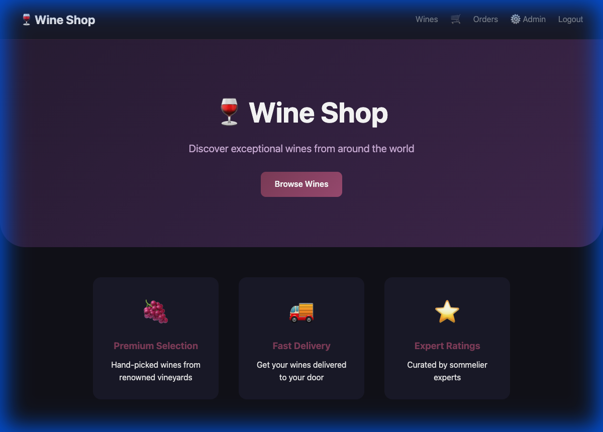
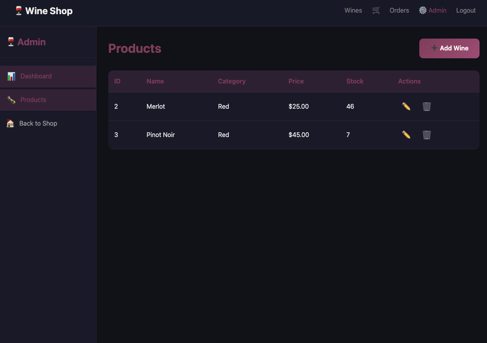

# Wine Shop 🍷

A full-stack e-commerce application for an online wine shop.



## 🌐 Live Demo

| Service | URL |
|---------|-----|
| 🌐 Frontend | https://wine-shop-api-l1i5.vercel.app |
| ⚙️ Backend API | https://wine-shop-api.onrender.com/api |
| 📚 Swagger Docs | https://wine-shop-api.onrender.com/swagger/index.html |

## 🚀 Tech Stack

| Layer | Technology |
|-------|------------|
| **Frontend** | Vue 3, Vite, Pinia, Vue Router |
| **Backend** | Go, Gin, GORM |
| **Database** | PostgreSQL |
| **Auth** | JWT, BCrypt |
| **Docs** | Swagger/OpenAPI |
| **Hosting** | Vercel (Frontend), Render (Backend) |

## 🛠️ Local Development

```bash
# Clone the repo
git clone https://github.com/montg1/wine-shop-api.git
cd wine-shop-api

# Start everything with Docker
docker compose up -d --build
```

| Service | URL |
|---------|-----|
| 🌐 Frontend | http://localhost:3000 |
| ⚙️ API | http://localhost:8080/api |
| 📚 Swagger | http://localhost:8080/swagger/index.html |

## 📦 Features

### Customer Features
- ✅ Browse wine catalog
- ✅ User registration & login
- ✅ Add wines to cart
- ✅ Checkout & place orders
- ✅ View order history

### Admin Features
- ✅ Dashboard with stats
- ✅ Create new wines
- ✅ Update wine details
- ✅ Delete wines from catalog



## 📚 API Endpoints

### Public
| Method | Endpoint | Description |
|--------|----------|-------------|
| GET | `/api/health` | Health check |
| POST | `/api/register` | Register user |
| POST | `/api/login` | Login & get JWT |
| GET | `/api/products` | List wines |
| GET | `/api/products/:id` | Wine details |

### Protected (User)
| Method | Endpoint | Description |
|--------|----------|-------------|
| GET | `/api/cart` | View cart |
| POST | `/api/cart` | Add to cart |
| POST | `/api/orders` | Checkout |
| GET | `/api/orders` | Order history |

### Protected (Admin)
| Method | Endpoint | Description |
|--------|----------|-------------|
| POST | `/api/admin/products` | Create wine |
| PUT | `/api/admin/products/:id` | Update wine |
| DELETE | `/api/admin/products/:id` | Delete wine |

## 🗂️ Project Structure

```
wine-shop-api/
├── cmd/server/          # Go entry point
├── internal/
│   ├── domain/          # Models
│   ├── handler/         # HTTP handlers
│   ├── middleware/      # Auth middleware
│   └── service/         # Business logic
├── pkg/
│   ├── config/          # Database config
│   └── utils/           # JWT utils
├── docs/                # Swagger docs
├── frontend/            # Vue 3 app
│   ├── src/
│   │   ├── views/       # Page components
│   │   ├── stores/      # Pinia stores
│   │   ├── services/    # API client
│   │   └── router/      # Vue Router
│   ├── Dockerfile
│   └── nginx.conf
├── docker-compose.yml
└── .github/workflows/   # CI/CD
```

## 🧪 Testing

```bash
# Run integration tests
chmod +x test_api.sh
./test_api.sh
```

## 📄 License

MIT
