# Wine Shop 🍷

A full-stack e-commerce application for an online wine shop with AI-powered wine recommendations.

## 🌐 Live Demo

| Service | URL |
|---------|-----|
| 🌐 Frontend | https://wine-shop-api-l1i5.vercel.app |
| ⚙️ Backend API | https://wine-shop-api.onrender.com/api |
| 📚 Swagger Docs | https://wine-shop-api.onrender.com/swagger/index.html |

## 🚀 Tech Stack

| Layer | Technology |
|-------|------------|
| **Frontend** | Vue 3, Vite, Pinia, Vue Router |
| **Backend** | Go, Gin, GORM |
| **Database** | PostgreSQL |
| **Auth** | JWT, BCrypt |
| **Images** | Cloudinary CDN |
| **Docs** | Swagger/OpenAPI |
| **Hosting** | Vercel (Frontend), Render (Backend) |

## 🔄 CI/CD Pipeline

```mermaid
flowchart LR
    A[👨‍💻 Developer] -->|git push| B[GitHub]
    B -->|trigger| C[GitHub Actions]
    
    subgraph CI ["🔧 CI Pipeline"]
        C --> D[Build & Test]
        D --> E[Security Tests]
        E --> F[Docker Build]
    end
    
    subgraph CD ["🚀 CD Pipeline"]
        F -->|auto-deploy| G[Render]
        F -->|auto-deploy| H[Vercel]
    end
    
    G -->|Go Backend| I[(PostgreSQL)]
    H -->|Vue Frontend| J[🌐 Users]
    G --> J

    style A fill:#4CAF50
    style B fill:#333
    style C fill:#2088FF
    style G fill:#46E3B7
    style H fill:#000
    style I fill:#336791
    style J fill:#FF6B6B
```



### Pipeline Stages

| Stage | Description |
|-------|-------------|
| **Build & Test** | Go compilation, unit tests, code formatting |
| **Integration Tests** | API tests with PostgreSQL service |
| **Security Tests** | RBAC, Rate Limiting, JWT, SQL Injection checks |
| **Docker Build** | Verify container builds correctly |
| **Deploy Backend** | Auto-deploy to Render on push to `main` |
| **Deploy Frontend** | Auto-deploy to Vercel on push to `main` |

## 🔐 Security Features

- ✅ **Password Hashing** - BCrypt with secure cost factor
- ✅ **JWT Authentication** - Token-based auth with expiration
- ✅ **Role-Based Access Control (RBAC)** - Admin vs Customer roles
- ✅ **Rate Limiting** - 10 req/min for auth, 100 req/min general
- ✅ **Input Validation** - Gin binding validation
- ✅ **CORS Protection** - Configured for allowed origins

## 🛠️ Local Development

```bash
# Clone the repo
git clone https://github.com/montg1/wine-shop-api.git
cd wine-shop-api

# Start everything with Docker
docker compose up -d --build
```

| Service | URL |
|---------|-----|
| 🌐 Frontend | http://localhost:3000 |
| ⚙️ API | http://localhost:8080/api |
| 📚 Swagger | http://localhost:8080/swagger/index.html |

## 📦 Features

### Customer Features
- ✅ Browse wine catalog
- ✅ **Search wines by name**
- ✅ **Filter by category** (Red, White, Rosé)
- ✅ User registration & login
- ✅ Add wines to cart
- ✅ Checkout & place orders
- ✅ View order history
- ✅ **Leave reviews & ratings** ⭐
- ✅ **🤖 Wine Chatbot** - AI recommendations

### Admin Features
- ✅ Dashboard with stats
- ✅ Create new wines
- ✅ Update wine details
- ✅ Delete wines from catalog
- ✅ **Image upload** (Cloudinary)
- ✅ **Admin-only access** (RBAC)

## 🤖 Wine Chatbot

The built-in chatbot helps customers find the perfect wine:

| Command | Response |
|---------|----------|
| "Red wines" | Shows all red wines |
| "White wines" | Shows all white wines |
| "Under $40" | Budget-friendly options |
| "Premium" | Top-priced selections |
| "Recommend something" | Random picks |

## 📚 API Endpoints

### Public
| Method | Endpoint | Description |
|--------|----------|-------------|
| GET | `/api/health` | Health check |
| POST | `/api/register` | Register user |
| POST | `/api/login` | Login & get JWT |
| GET | `/api/products` | List wines |
| GET | `/api/products?search=X` | Search by name |
| GET | `/api/products?category=X` | Filter by category |
| GET | `/api/products/:id` | Wine details |
| GET | `/api/products/:id/reviews` | Get reviews |

### Protected (User)
| Method | Endpoint | Description |
|--------|----------|-------------|
| GET | `/api/me` | Get current user info |
| GET | `/api/cart` | View cart |
| POST | `/api/cart` | Add to cart |
| POST | `/api/orders` | Checkout |
| GET | `/api/orders` | Order history |
| POST | `/api/products/:id/reviews` | Create review |
| DELETE | `/api/products/:id/reviews/:reviewId` | Delete review |

### Protected (Admin Only)
| Method | Endpoint | Description |
|--------|----------|-------------|
| POST | `/api/admin/products` | Create wine |
| PUT | `/api/admin/products/:id` | Update wine |
| DELETE | `/api/admin/products/:id` | Delete wine |
| POST | `/api/admin/upload` | Upload image |

## 🗂️ Project Structure

```
wine-shop-api/
├── cmd/server/          # Go entry point
├── internal/
│   ├── domain/          # Models
│   ├── handler/         # HTTP handlers
│   ├── middleware/      # Auth, Admin, RateLimiter
│   └── service/         # Business logic
├── pkg/
│   ├── config/          # Database config
│   └── utils/           # JWT utils
├── docs/                # Swagger docs
├── frontend/            # Vue 3 app
│   ├── src/
│   │   ├── components/  # ChatbotWidget
│   │   ├── views/       # Page components
│   │   ├── stores/      # Pinia stores
│   │   ├── services/    # API client
│   │   └── router/      # Vue Router
│   ├── Dockerfile
│   └── nginx.conf
├── docker-compose.yml
└── .github/workflows/   # CI/CD
```

## 🧪 Testing

```bash
# Run integration tests
./test_api.sh

# Run security tests
./test_security.sh
```

## 📄 License

MIT
